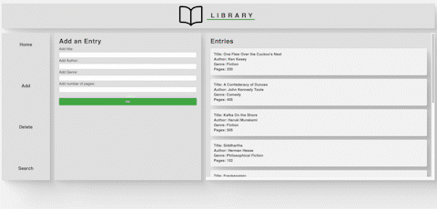

I'm a Software Engineer proficient in both Frontend development and Backend development. I have knowledge in HTML, CSS, Javascript, Node.Js, Express, MongoDB, and React.

See [my website](https://lucdumas.netlify.app/) for more information!

## My Skill Set  
<table><tr><td valign="top" width="50%">

 
### Frontend  
 

  
  
  
  
  
 
 
 

</td><td valign="top" width="50%">
 
### Backend  
 

  
  
  
  
  

</tbody></table>
 

### My Projects 

 <table bordercolor="#66b2b2">
  
  <tr>
   <td width="50%" valign="top">
      <h3 align="center">TrailHead Map</h3>
         
        
         
        

          
    
  
      

        
<strong>Full-Stack MERN Application</strong> - Website where users can log on to mark different trail heads on the map!

    </td>
     <td width="50%" valign="top">
      <h3 align="center">Portfolio Site</h3>
         
        
         
        

          
    
  
      

      
<strong>HTML5, CSS3, SASS & Javascript</strong> - Portfolio Site including links to my projects and ways to get in contact with me.

        </td>
  </tr>
  
  <tr>
    <td width="50%" valign="top">
      <h3 align="center">Library</h3>
         
        
         
        
          
    
  
      

      
<strong>JavaScript, Express, NodeJS and MongoDb.</strong> -This application allows a user to add, delete, search, and browse through a collection of books. 

        </td>
   <td width="50%" valign="top">
      <h3 align="center">Sandkamp Woodworks</h3>
         
        
         
        
 
    
  
      

      
<strong>Html, CSS, SASS, and JS</strong> - Client website that clearly displayed their work and contact information

        </td>
  </tr>
  
  <tr>
    <td width="50%" valign="top">
      <h3 align="center">ADV Routes</h3>
         
        
         
        

    
  
      

      
<strong> HTML, CSS, JavaScript, and Tailwind</strong> - An application where users can track adventure motorcycling routes.

        </td>
   <td width="50%" valign="top">
      <h3 align="center">JJ Construction</h3>
         
        
         
        
   
    
  
      

      
<strong> HTML, CSS, and JavaScript </strong> - This project includes flexbox and grid layouts and was designed for responsive window sizing. 

        </td>
  </tr>
</table>
 

## Connect with me  

  

  
 

## Github Stats  

 
